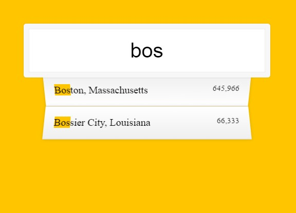

## JavaScript30 Day 6 - Type Ahead

A search input that takes in data and match the key input with an array of data which is fetched from a JSON file from Github. When matches are found, display a list of matches with respective data of city, state and population.

[View demo site here.](https://webdevtuts.github.io/javascript30_06/)

